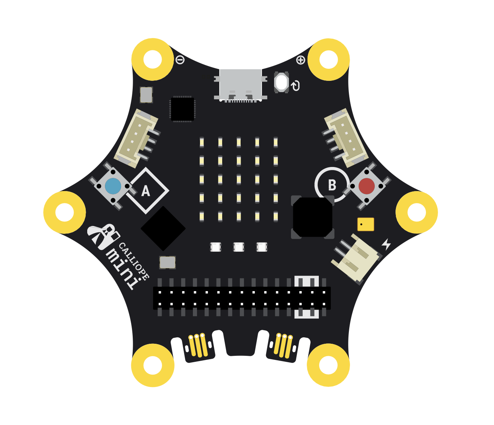
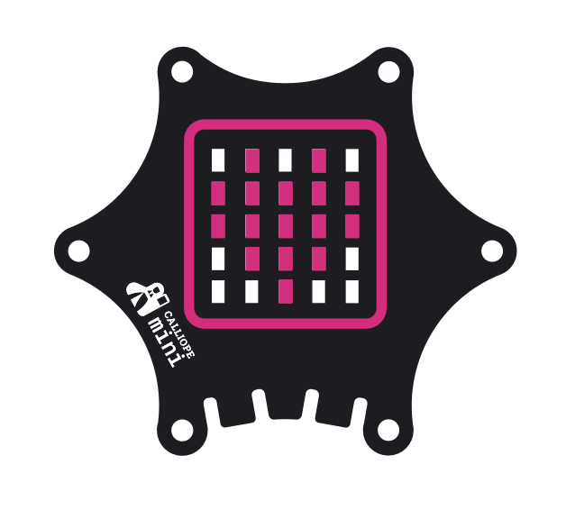
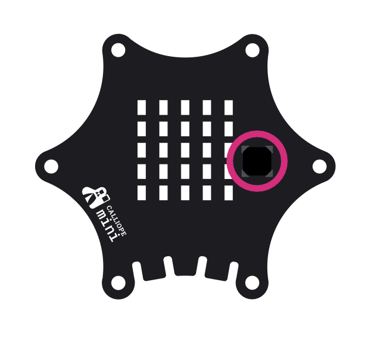
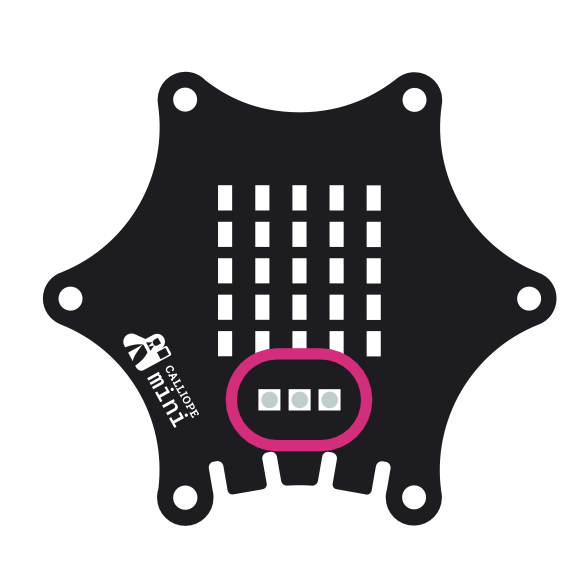
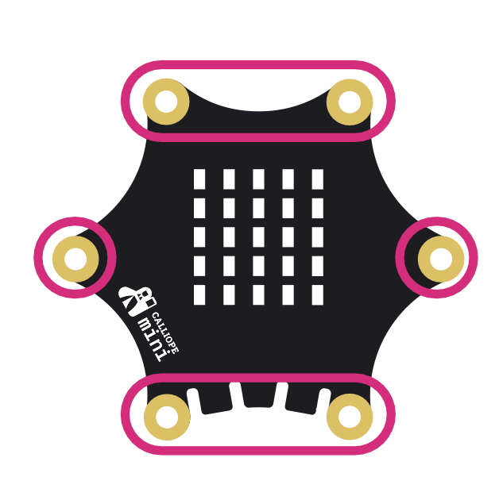
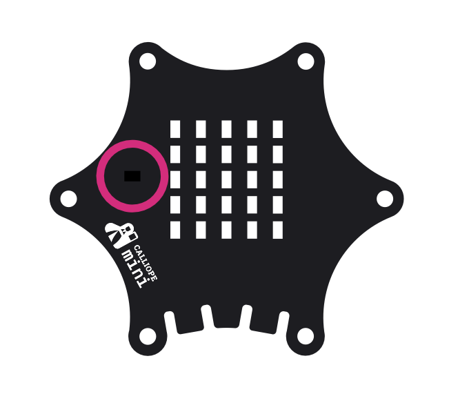
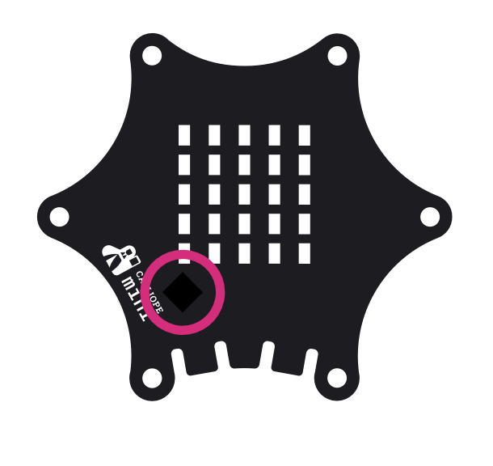
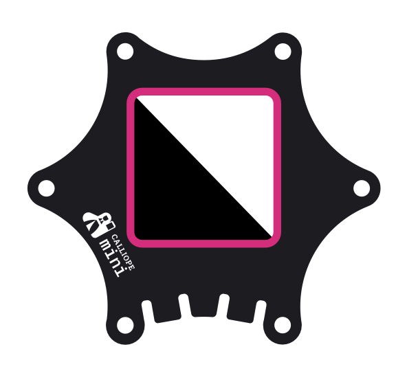
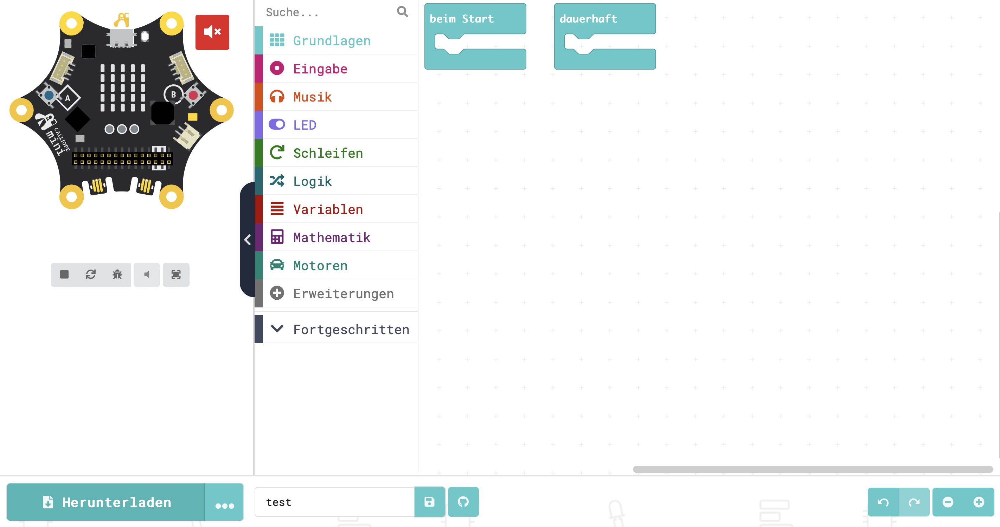

# Starcode Detektivinnen - Einführung ins Calliope-Programmieren

Hallo, Starcode-Detektivinnen! 🕵️‍♀️ Ihr werdet heute eine ganz besondere Mission haben: Fangt die Spioninnen! Die Spioninnen, die ihr jagt, sind berüchtigte Hackerinnen, die die Welt der Informatik auf den Kopf gestellt haben! Sie haben geheime Codes gestohlen, die sie jetzt um jeden Preis verstecken wollen. Aber diese Codes sind auch für Starcode wichtig, weshalb ihr die Spioninnen unbedingt finden müsst und den wichtigen Code zurückbringen sollt! Das ist eine Herausforderung, die ihr nur mithilfe eurem Calliope Mini meistern könnt. Seid ihr bereit? 🔍

Aber bevor wir starten, gucken wir uns erst einmal an, was Calliope überhaupt ist.

### Was ist Calliope?

Der **Calliope Mini** ist ein kleiner Mikrocontroller, der speziell dafür entwickelt wurde, spielerisch Programmieren zu lernen. Er ist wie ein kleiner Computer, den man programmieren kann und mit dem sich viele spannende Projekte verwirklichen lassen. Der Calliope ist das perfekte Werkzeug für Detektivinnen, denn er hat viele Funktionen und Sensoren, die euch bei eurer Mission unterstützen!

  

### Funktionen und Sensoren des Calliope Mini

- **LED-Matrix**: Die 5x5 LED-Anzeige leuchtet und zeigt Nachrichten, Symbole oder Zahlen an. Hier könnt ihr zum Beispiel euren Wörter anzeigen lassen oder blinkende Signale programmieren.

  

- **Lautsprecher**: Der Calliope Mini hat einen kleinen Lautsprecher, mit dem ihr Töne und Melodien abspielen könnt. 

  

- **Tasten A und B**: Diese zwei Knöpfe lassen sich für verschiedene Aktionen programmieren. Ihr könnt sie zum Beispiel nutzen, um bestimmte Aufgaben oder Aktionen zu starten.

  

- **Farbiges LED-Licht**: Auf dem Calliope Mini befindet sich eine farbige LED, die in verschiedenen Farben leuchten kann. 

  

- **Touch-Pins**: An die mit P0, P1, P2 und P3 beschrifteten Pins des Calliope mini kannst du ebenfalls Sensoren anschließen. Zudem sind sie berührungsempfindlich, so wie du es beispielsweise von Touchscreens kennst.

  

- **Bewegungssensor**: Der Calliope Mini hat einen eingebauten Bewegungssensor, der erkennt, wenn er bewegt, geschüttelt oder gekippt wird. 

  

- **Temperatur- und Lichtsensor**: Mit diesen Sensoren könnt ihr die Helligkeit und die Temperatur in der Umgebung messen. 

  

  

## Der Detektivinnen-Ausweis

Bevor es losgeht, braucht ihr einen Ausweis, der euch als echte Starcode-Detektivinnen ausweist! Mit dem Calliope Mini könnt ihr euren eigenen Detektivinnen-Badge programmieren – er zeigt euren Namen auf der LED-Matrix und spielt einen individuellen Ton ab. Wenn ihr wollt, könnt ihr die kleine LED Leuchte sogar in eurer Lieblingsfarbe leuchten lassen!

### Schritt-für-Schritt-Anleitung: Euer persönlicher Detektivinnen-Badge

#### 1. **Öffnet die Programmierumgebung**
   - Geht auf die Website des Calliope Mini und startet die Programmierumgebung im [MakeCode Editor](https://makecode.calliope.cc). Erstellt ein neues Projekt und gebt ihm einen Namen. Wählt außerdem Calliope mini 3 aus. 

     
   
#### 2. **Zeigt euren Namen auf der LED-Matrix**- Wählt den Block **"Zeige Text"**.
   - Für Programme, die angezeigt werden sollen sobald der Calliope angeschaltet wird, ist es wichtig Befehle, dauerhaft zu programmieren 
   - Hierfür gibt es einen wichtigen Block in der Kategorie **"Grundlagen"**, suche diesen Block und ziehe ihn auf deine Programmieroberfläche.
   - In der gleichen Kategorie findet sich auch ein Block, welcher Text auf dem Calliope anzeigt, ziehe diesen Block in dein Programm.

#### 3. **Hinterlegt einen Ton und Melodie**
   - Geht in die Kategorie **Musik**.
   - Hier findet ihr verschiedene Möglichkeiten, Töne oder Melodien zu programmieren.
   - Wenn ihr euch entschieden habt, zieht diesen Block auf in euer Programm.

#### 4. **Fügt eine persönliche Farbe hinzu**
   - Verschiedene Möglichkeiten, die Farben der RGB-LED zu ändern, findet ihr wieder in der Kategorie **"Grundlagen"**.

#### 5. **Programm hochladen und ausprobieren**
   - Wenn ihr alle Blöcke platziert habt, könnt ihr links in der Simulation euer Programm austesten, wenn ihr die Start-Taste drückt.
   - Wenn ihr zufrieden mit euerm Badge seid, ladet euer Programm links unten unter **"Herunterladen"** herunter und verbindet euren Calliope Mini mit dem Computer.
   - Auf dem Desktop eures Computers erscheint nun ein Symbol mit dem Namen **"MINI"** - daran erkennt ihr, dass der Calliope richtig verbunden wurde.
   - Ladet nun das Programm auf den Calliope Mini, indem ihr die heruntergeladene HEX-Datei auf das **"MINI"**-Symbol zieht und testet es!

Herzlichen Glückwunsch, Detektivinnen! Ihr habt euren ersten Auftrag erfolgreich abgeschlossen und besitzt nun einen persönlichen Detektivinnen-Ausweis. Jetzt seid ihr offiziell bereit für eure Mission!

