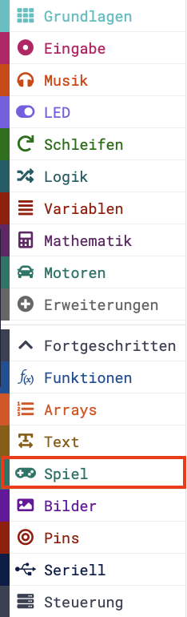
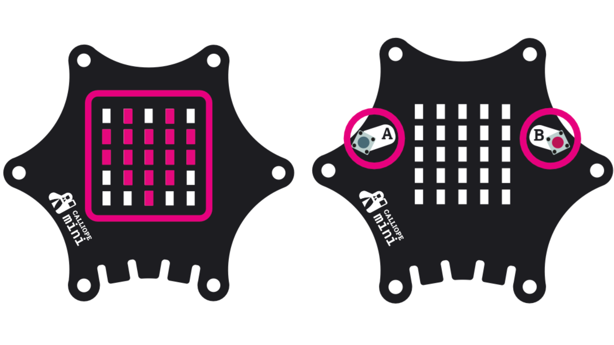
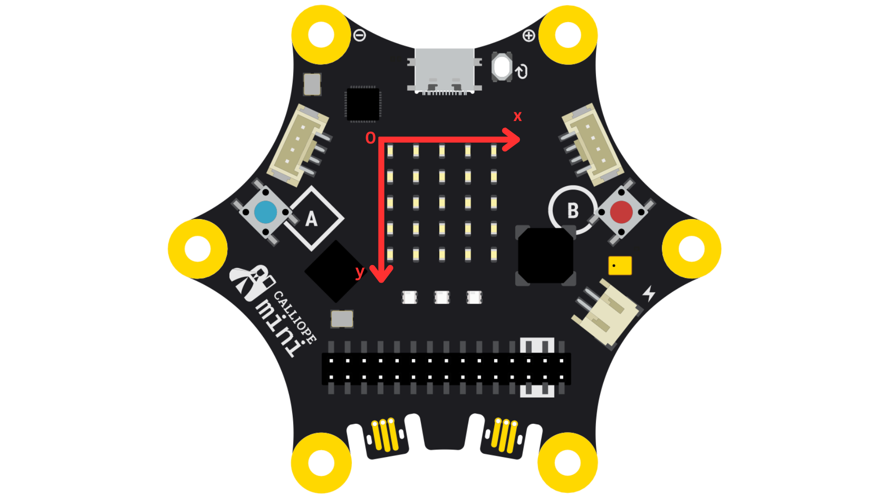
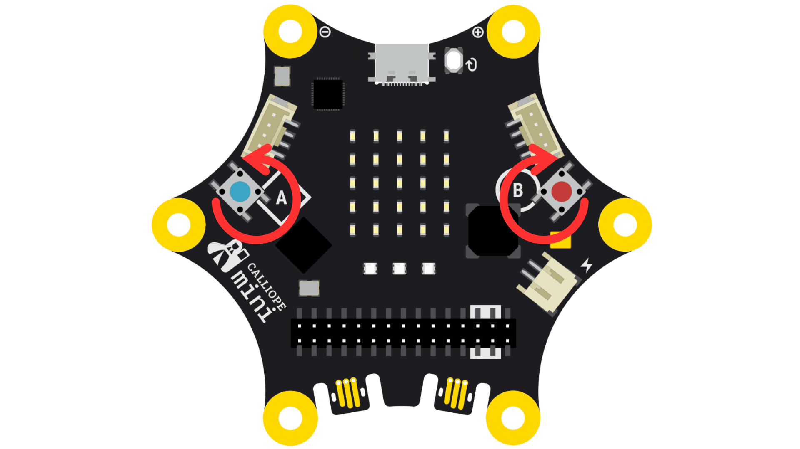

# Fang die Spionin

Jetzt wo ihr mit dem Kompass, dem Magnetfelddetektor und dem Thermometer die nötigen Instrumente habt, die Spioninnen ausfindig zu machen, wird die Spur immer heißer...

Ihr seid den Spioninnen dicht auf der Spur und rechnet damit, dass ihr sie bald finden werdet!

... Aber was dann? Um für den Ernstfall gewappnet zu sein, wollt ihr üben, die Spioninnen zu fangen. 
Auch dabei kann euch zum Glück das Calliope Board helfen.

Dafür simuliert ihr auf dem Calliope folgende Situation: 
 
Ihr findet eine Spionin, verfolgt sie zu Fuß und leitet sie in eine Sackgasse. 
Um euch zu entkommen, muss die Spionin also versuchen, irgendwie an euch vorbei zu laufen.

  

Jetzt müsst ihr schnell reagieren können! Und genau das üben wir mit einem selbst programmierten Spiel auf dem Board.

Für diese Aufgabe werden wir viel mit den Blöcken aus dem **Spiel**-Block unter **Fortgeschritten** arbeiten. 
Klappt diesen also schon mal auf!

  

## Schritt 1: Start

Das Ganze werden wir auf der 5x5 Matrix und den beiden Knöpfen A und B aufbauen.

  

Auf der Matrix werdet ihr durch eine leuchtende LED dargestellt, genauso wie auch die Spionin. 
Die Spionin steht still während ihr euch frei um sie herum bewegt und versucht sie zu fangen.
Ihr bewegt euch geradeaus, hin und her auf der LED-Matrix, und wechselt die Richtung indem ihr auf die Knöpfe A oder B drückt.

Als allererstes erstellen wir zwei Variablen: 
Eine Variable *detektivin*, die euch darstellt, und eine *spionin* für eure Gegnerin. 
Diese Variablen werden im Verlauf des Spiels benutzt, um anzuzeigen, wo ihr euch bzw. die Spionin sich befindet.

Die beiden leuchtenden LEDs, die die Position von *detektivin* und *spionin* anzeigen, sind in diesem Spiel als sogenannte *'Sprites'* eingestellt. 
Die zugehörigen Blöcke findet ihr in der Kategorie **Spiel**.

Beim Start platzieren wir uns erstmal selbst, also die LED für *detektivin*. 
Dafür brauchen wir den *erzeuge Sprite an Position x: y:*- Block aus **Spiel**. 
Dann kombinieren wir diesen mit *setze detektivin auf* aus dem **Variablen**-Block.
Beim Start wollen wir in der mittleren Reihe in der Mitte stehen. 
Lege die x- und y-Koordinaten dementsprechend fest!

  

Beim Start soll ebenfalls die *spionin* gesetzt werden.
Anstatt der *spionin* jedoch einen festen Wert zuzuweisen, wollen wir den Überraschungseffekt simulieren - wir wissen schließlich nicht, wo genau wir die *spionin* vorfinden werden!

Dafür brauchen wir den **Mathematik**-Block, um zwei zufällige Zahlen zwischen 0 und 4 zu erzeugen.
Diese Zahlen werden bei der Erzeugung des Sprites als x- bzw. y-Koordinate der *spionin* festgelegt.

## Schritt 2: Knöpfe programmieren

Jetzt schauen wir uns an, was passieren soll, wenn wir auf einen der Knöpfe unseres Calliope Boards drücken:
Diese sollen uns erlauben, uns um 90 Grad nach links oder rechts zu drehen.

Da der Knopf A sich auf der linken und B sich auf der rechten Seite unseres Boards befinden, dreht sich unsere *detektivin* nach links mit A und nach rechts mit B. 
Die Blöcke um die *detektivin* zu bewegen, findest du wieder unter **Spiel**.

  

Die *detektivin* bewegt sich bereits automatisch, mit den Knöpfen wollen wir sie lediglich *um 90° drehen*.

Zusätzlich soll das Spiel beendet werden, wenn Knopf A und B gleichzeitig gedrückt werden.
Den passenden Block gibt es wieder unter **Spiel**.

## Schritt 3: Spielablauf

Alles was jetzt folgt, soll **dauerhaft** ablaufen.

Da eine Trainingseinheit zuende sein soll, wenn wir die Spionin 5 mal gefangen haben, muss das als allererstes geprüft werden.

Wenn wir also geprüft haben, ob der Spielstand < 5 ist, können wir weitere Aktionen ausführen (**Spiel**-Block):
- die *detektivin* soll vom Rand abprallen, wenn sie diesen berührt, und
- die *detektivin* bewegt sich (automatisch) um 1, und
- pausiert dann 500 ms

## Schritt 4: Spionin gefangen?

Wir befinden uns immer noch im **dauerhaften** Spielablauf.

Wir können kontrollieren, ob die *detektivin* der *spionin* in die Quere gekommen ist, indem wir als Bedingung für den wenn-dann-Block festlegen, ob die beiden sich berühren.

**Wenn** das der Fall ist, **dann**:
1. ändern wir den Spielstand um 1
2. löschen die *spionin*
3. erzeugen eine neue *spionin* auf die genau gleiche Art wie beim Start des Spiels
4. pausieren 500 ms

Nun müssen wir noch festlegen, was **ansonsten** passiert, wenn der Spielstand nicht < 5 ist:

Das Spiel wird beendet, genauso wie wenn wir auf die Knöpfe A und B gleichzeitig drücken.

## Bonus

Wenn ihr wollt, könnt ihr im **wenn-dann** Block auch noch Soundeffekte einfügen, die zu der Situation 'Spionin gefangen' passen!

Auch mit den RGB-LEDs könnt ihr noch ein bisschen herumspielen. Zum Beispiel könnten diese immer grün aufleuchten, wenn ihr die Spionin gefangen habt.