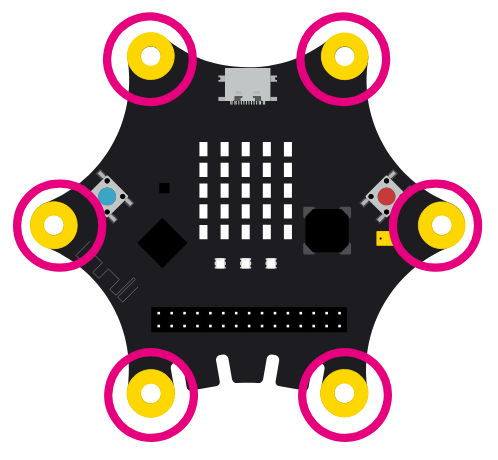

# Lügendetektor
Glückwunsch, ihr habt eine der Spioninnen gefangen! Sie ist aber ganz schön hartnäckig und will euch nicht 
verraten, wo sie ihr Diebesgut versteckt hat. Ihr habt ein paar Vermutungen, aber woher wisst ihr,
welche die Richtige ist? Ein Lügendetektor wäre jetzt praktisch...

Plötzlich fällt euch ein, dass ihr mit Calliope ja einfach selber einen Lügendetektor bauen könnt!
Also packt ihr euer Material aus und macht euch an die Arbeit.

---
### Schritt 1: Idee
---
Einen voll funktionsfähigen Lügendetektor können wir leider nicht bauen. Dafür sind die Sensoren
im Calliope Mini zu ungenau. Stattdessen können wir aber etwas simulieren, was einem echten Lügendetektor
schon sehr nahe kommt.

Der Calliope Mini hat nämlich Berührungssensoren, die andere Werte ausgeben, wenn ein Stromkreis geschlossen
wird. In unserem Fall berühren wir zwei Pins, einen Minus- und einen Pluspol. Wenn der Stromkreis
geschlossen ist kann unser Calliope messen, wie stark der Widerstand zwischen den zwei Polen ist.

  

In einem richtigen Lügendetektor würden wir jetzt jede Veränderung im elektrischen Widerstand der Haut
messen. Das Prinzip dahinter nennt sich [Elektrodermale Aktivität](https://de.wikipedia.org/wiki/Elektrodermale_Aktivit%C3%A4t).
Mit unseren Sensoren bekommen wir aber keine zuverlässigen Werte, deshalb schummeln wir ein bisschen:
Wir überprüfen nur, ob jemand die Pins anfasst, danach geben wir nach ein wenig Bedenkzeit eine zufällige
Antwort aus.

---
### Schritt 2: Code
---
#### Start: Pin Konfigurieren
Zuerst setzen den Pin P0 (also unseren Berührungssensor) auf den resistiven Berührungsmodus, damit er
so funktioniert wie oben beschrieben.

#### Dauerhaft: Lügen erkennen
Als nächstes lesen wir aus, wie stark der Widerstand zwischen
Minus- und Pluspol ist. Als Pluspol nehmen wir hier P0, die Pins
P1, P2 und P3 würden aber genauso funktionieren.
Wenn wir jetzt P0 und den Minuspol berühren, können wir bei P0
Werte auslesen und in einer Variablen speichern.

Wenn wir den Stromkreis nicht schließen, sind die Werte bei ungefähr
600, wenn der Kreis geschlossen ist meistens unter 100.
Deswegen überprüfen wir zuerst, ob der Stromkreis geschlossen ist, 
also der Wert von P0 unter beispielsweise 500 ist.

Weil wir jetzt nicht wirklich zuverlässig mit der Höhe des gespeicherten Wertes rechnen können, benutzen wir ihn einfach
als Zufallsgenerator: Wenn der Wert durch 2 teilbar ist, zeigen
wir mit den LEDs einen Haken (Wahrheit) an, wenn nicht ein Kreuz (Lüge).

Danach pausieren wir das Programm kurz, damit das Ergebnis auch
ein bisschen länger angezeigt wird und nicht sofort von der
nächsten Messung wieder überschrieben wird. Probier mal aus,
was passiert, wenn du am Ende keine Pause hast! Dann siehst du
sofort, warum wir sie brauchen!

#### Welche Blöcke brauchen wir?
- Um eine Variable zu speichern, benutzen wir **Variablen->setze [wert] auf [...]**
- Um zu prüfen, ob der Stromkreis geschlossen ist, benutzen wir **Logik->wenn [...] dann**
- Wann ist der Stromkreis geschlossen? Wenn unsere Variable kleiner
als 500 ist! Dafür benutzen wir **Logik->[...] < [...]** ("kleiner als" Zeichen). Diesen Block können wir auf das "**wahr**" im
"**wenn ... dann**" Block ziehen, um es mit dem "kleiner als" Vergleich
zu ersetzen.
  
- Je nach Ergebnis wollen wir etwas anderes anzeigen, also benutzen
wir **Logik->wenn [...] dann ... ansonsten**.
- Um zu schauen, ob der Messwert durch 2 teilbar ist, benutzen wir
**Mathematik->Rest von [...] / [...]**. Das Ergebnis vergleichen wir,
ähnlich wie vorhin, mit **Logik->[...] = [...]**.
- Um ein Symbol anzuzeigen, benutzen wir **Grundlagen->zeige Symbol**.
- Zuletzt pausieren wir, um das Ergebnis vor der nächsten Messung
anzuzeigen. Dafür verwenden wir **Grundlagen->pausiere (ms) [...]**.

---

Jetzt hast du hoffentlich alle Werkzeuge, um einen (mehr oder weniger) funktionstüchtigen Lügendetektor zu bauen! Viel Erfolg!
